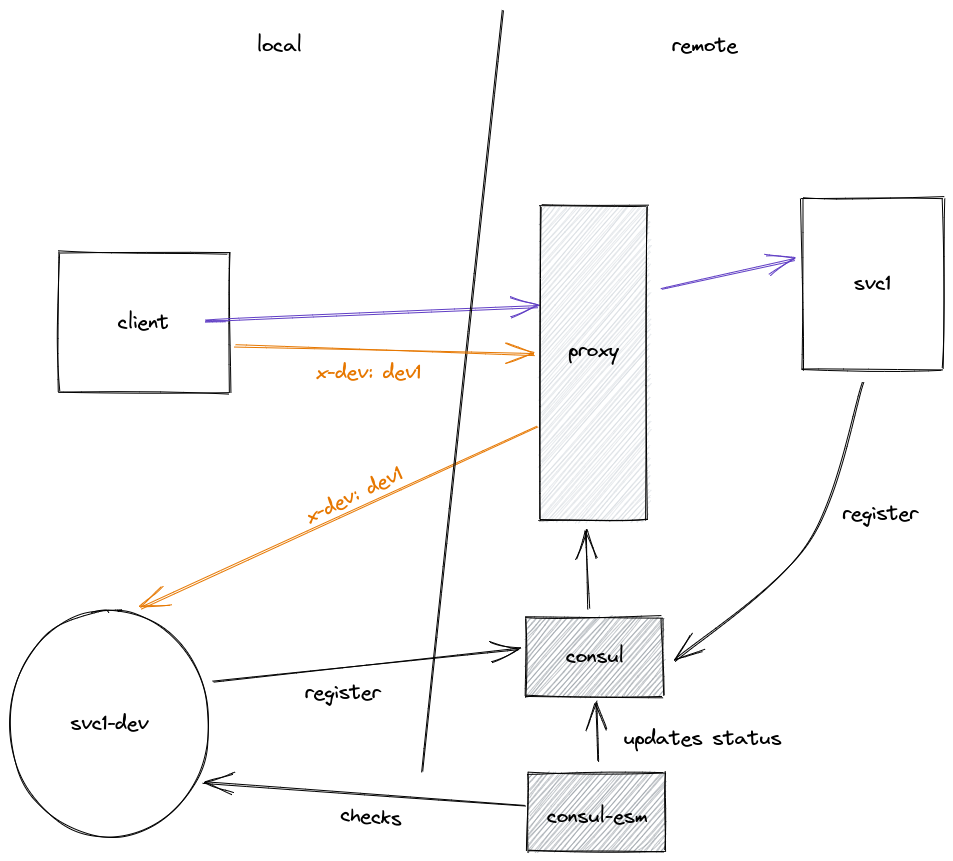

## Local/Remote development environment

A solution that allows a local service running in a developer workstation to be invoked inside a remote dev environment workflow.



## Register services

For this test, 3 services will be registered. 2 local services (the ones on the development environment), and one remote service (the one on the developer workstation). In this case, **local** means local to the consul agent, not the workstation.

|File|Description|
|----|-----------|
|local-svc1.json|Local service #1|
|local-svc2.json|Local service #2|
|remote-svc1-dev.json|Remote service #1|


### Registration commands

Open a terminal, and run the following commands to register the services

**Register the first local service**

```bash
curl --request PUT --data @local-svc1.json 127.0.0.1:8500/v1/agent/service/register
```

**Register the second local service**

```bash
curl --request PUT --data @local-svc2.json 127.0.0.1:8500/v1/agent/service/register
```

**Register the remote service instance**

```bash
curl --request PUT --data @remote-svc1-dev.json 127.0.0.1:8500/v1/catalog/register
```


### Access the services

```bash
curl -vvv http://127.0.0.1:8090/svc2
```

```json
{"message": "Response from svc2"}
```

```bash
curl -vvv http://127.0.0.1:8090/svc1
```

```json
{"message": "Response from svc1"}
```

```bash
curl -vvv --header "x-dev: dev"  http://127.0.0.1:8090/svc1
```

```json
{"message": "Response from svc1-dev"}
```


### Consul + Traefik notes
 
- Traefik rules are written in the service tags
- Consul services names, and Traefik router names should be different between local and remote services, as Traefik will throw an error about the same router with different configurations (check local-svc1 and remote-svc1-dev json files).